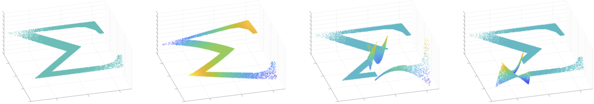
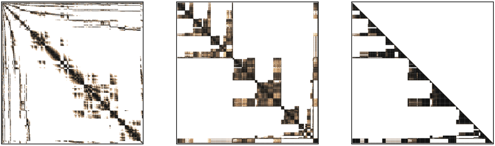
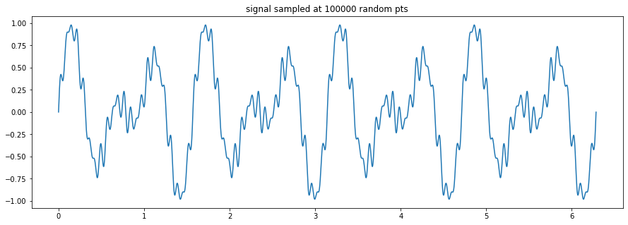
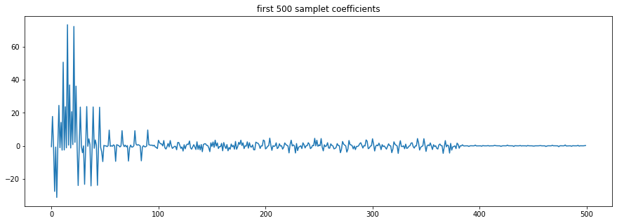
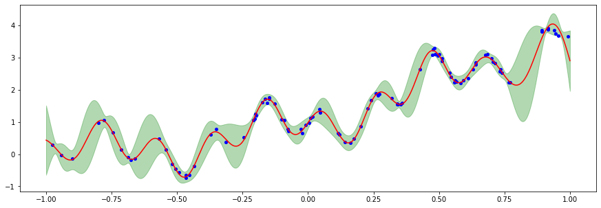

# FMCA
**Fast multiresolution covariance analysis**

FMCA is a header only library for the multiresolution analysis of scattered data and kernel matrices. It is developed
at the [Università della Svizzera italiana](https://www.usi.ch) in the research group of [Michael Multerer](http://usi.to/3ps).

Currently, the library features the construction of samplet bases and different versions of the pivoted Cholesky decomposition.
The fast samplet covariance compression introduced in 
[Samplets: Construction and scattered data compression](https://doi.org/10.1016/j.jcp.2022.111616)
will be added soon.

Different scaling distributions and samplets on a Sigma shaped point cloud my look for example like depicted below.


Representing an exponential covariance kernel with respect to this basis and truncating small entries leads to a sparse matrix
which can be factorized using nested dissection

The left panel shows the kernel matrix, the middle panel the reordered matrix and the right panel the Cholesky factor.


## Installation
FMCA is header only. It depends on [Eigen](https://eigen.tuxfamily.org),
which has to be installed in advance.

Moreover, thanks to [pybind11](https://github.com/pybind/pybind11), FMCA may be compiled into a python module.
To this end, pybind11 needs to be installed as well. Afterwards, the module can simply be compiled using cmake:
```
mkdir build
cd build
cmake -DCMAKE_BUILD_TYPE=Release ../
make
```
example files and the compiled library are then located in build/py

## Samplets

FMCA features a samplet basis, which can be used to localize a given signal in the frequency domain. Given for example a
signal sampled at 100000 random locations, e.g.,


the first 500 coefficients of the transformed signal looks like this


The example above can be found and modified in the jupyter notebook FMCA_Samplets

## Gaussian process learning

FMCA provides different variants of the pivoted (truncated) Cholesky decomposition, cp.
[On the low-rank approximation by the pivoted Cholesky decomposition](https://www.sciencedirect.com/science/article/pii/S0168927411001814)
and the references therein, that can be used for Gaussian process learning.

posterior mean (read) and posterior standard deviation (green) conditioned on the blue dots


The example above can be found and modified in the jupyter notebook FMCA_GP

A samplet matrix compression based approach will be added in the future (allowing for huge amounts of conditioning variables).
