# FMCA
**Fast multiresolution covariance analysis**

FMCA is a header only library for the multiresolution analysis of scattered data and kernel matrices. It is developed
at the [Università della Svizzera italiana](https://www.usi.ch) in the research group of [Michael Multerer](http://usi.to/3ps).

Currently, the library features the construction of samplet bases and different versions of the pivoted Cholesky decomposition,
as well as the fast samplet covariance compression introduced in 
[Samplets: Construction and scattered data compression](https://doi.org/10.1016/j.jcp.2022.111616).

Different scaling distributions and samplets on a Sigma shaped point cloud may look for example like depicted below.
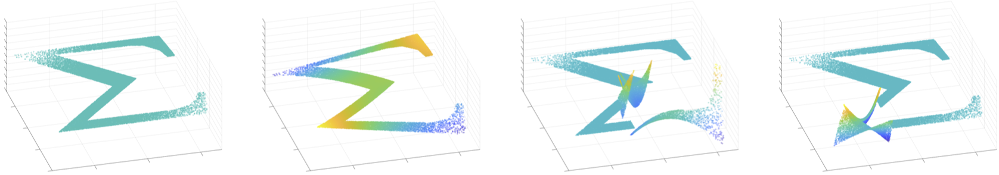

Representing an exponential covariance kernel with respect to this basis and truncating small entries leads to a sparse matrix
which can be factorized using nested dissection
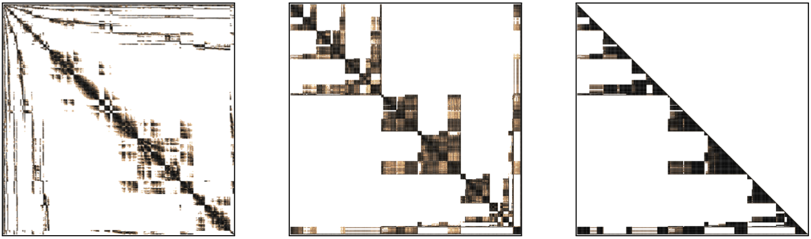
The left panel shows the kernel matrix, the middle panel the reordered matrix and the right panel the Cholesky factor.


## Installation
FMCA is header only. It depends on [Eigen](https://eigen.tuxfamily.org),
which has to be installed in advance.

Moreover, thanks to [pybind11](https://github.com/pybind/pybind11), FMCA may be compiled into a python module.
To this end, pybind11 needs to be installed as well. Afterwards, the module can simply be compiled using cmake:
```
mkdir build
cd build
cmake -DCMAKE_BUILD_TYPE=Release ../
make
```
example files and the compiled library are then located in build/py

## Samplets

FMCA features a samplet basis, which can be used to localize a given signal in the frequency domain. Given for example a
signal sampled at 100000 random locations, e.g.,
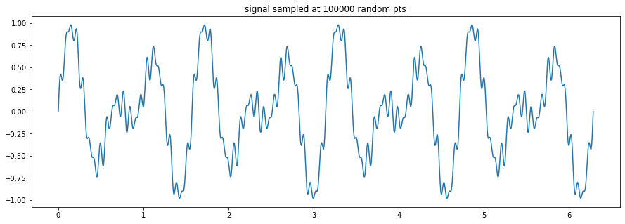

the first 500 coefficients of the transformed signal looks like this
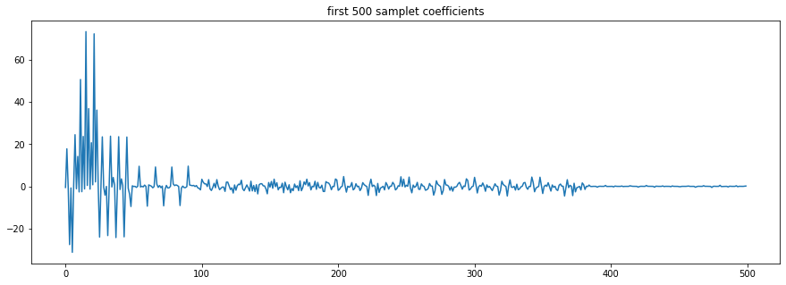

The example above can be found and modified in the jupyter notebook FMCA_Samplets

## Denoising

Since samplets have vanishing moments, a smooth signal is represented by very few large
coefficients, whereas white noise is spread evenly over all of them. Discarding the small
coefficients thus removes most of the noise and almost none of the signal. For a signal sampled at
10000 points and perturbed by Gaussian noise of standard deviation 0.15, thresholding at the
universal level, i.e. sigma*sqrt(2*log(N)), retains 39 coefficients and reduces the relative error
from 1.7e-1 to 1.8e-2.
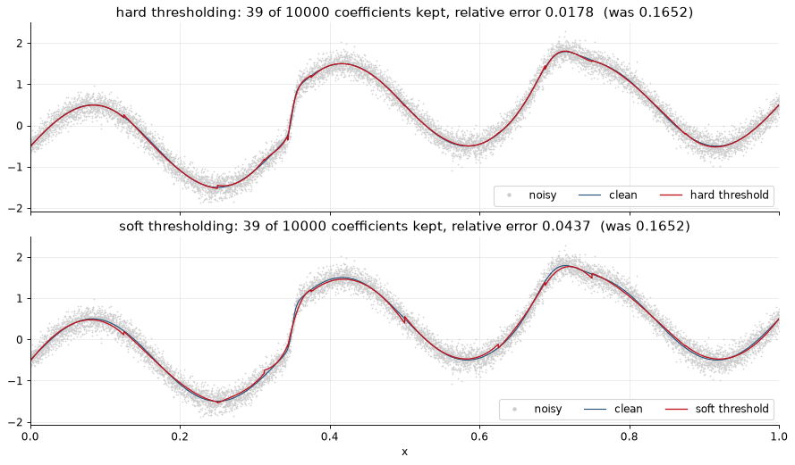

Edges survive this procedure, as a kink is encoded by a few *large* coefficients, which are never
discarded. Nothing in the construction requires the points to be equispaced, so the very same steps
denoise an image, here 600x512 pixels, of which 13278 samplet coefficients survive the threshold.
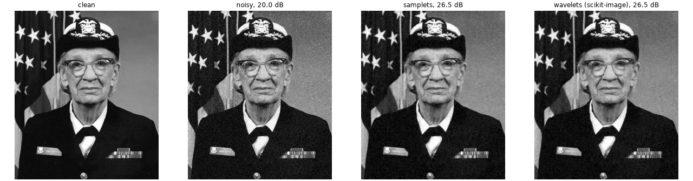

These examples can be found and modified in the jupyter notebooks
[FMCA_SampletDenoising1D](https://github.com/muchip/fmca/blob/master/py/FMCA_SampletDenoising1D.ipynb)
and [FMCA_SampletImageDenoising](https://github.com/muchip/fmca/blob/master/py/FMCA_SampletImageDenoising.ipynb).

## Adaptive tree search

The samplet coefficients moreover indicate *where* a function fails to be smooth, which can be fed
back into the cluster tree. Refining the tree uniformly splits every cluster, no matter whether the
data require it or not.
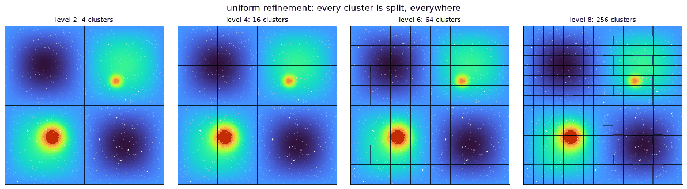

The second Binev-DeVore algorithm instead activates the clusters carrying the largest amount of
energy, until the energy left outside the tree drops below a prescribed tolerance. The leaves of the
resulting adaptive tree form a partition of the point cloud which is fine only where the function
varies. In the example below, 100000 scattered points are partitioned into 128 clusters, while
resolving the whole domain at the same finest scale would require 2048 uniform ones.
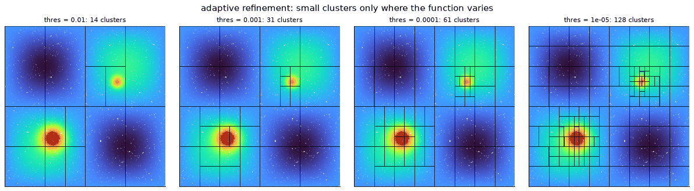

The tolerance is measured relative to the energy of the data and is therefore scale free. The
example above can be found and modified in the jupyter notebook
[FMCA_SampletAdaptiveClustering](https://github.com/muchip/fmca/blob/master/py/FMCA_SampletAdaptiveClustering.ipynb).

## Gaussian process learning

FMCA provides different variants of the pivoted (truncated) Cholesky decomposition, cp.
[On the low-rank approximation by the pivoted Cholesky decomposition](https://www.sciencedirect.com/science/article/pii/S0168927411001814)
and the references therein, that can be used for Gaussian process learning.

posterior mean (read) and posterior standard deviation (green) conditioned on the blue dots
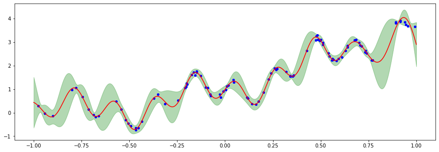

The example above can be found and modified in the jupyter notebook [FMCA_GP](https://github.com/muchip/fmca/blob/master/py/FMCA_GP.ipynb).

## Samplet Gaussian process filtering

A samplet matrix compression based approach is also available. It particular allows for filtering of the (compressed) kernel
matrix, thus mitigating the very ill-conditioning of the kernel matrix. 

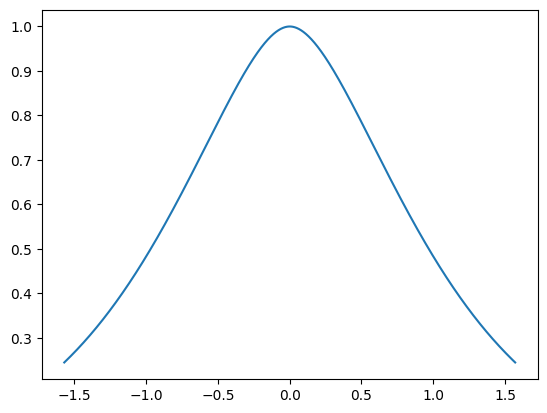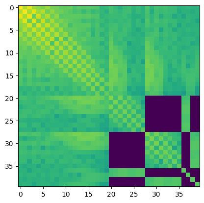

For the Matern-3/2 kernel shown on the left, just considering the diagonal block associated to the 40 largest entries, shown on the right,
leads to a relative approximation error of about 3e-5 of the kernel matrix in the Frobenius norm. Solving the associated system for the noisy
data set shown below, leads to an effective denoising. The corresponding expectation is shown in orange.

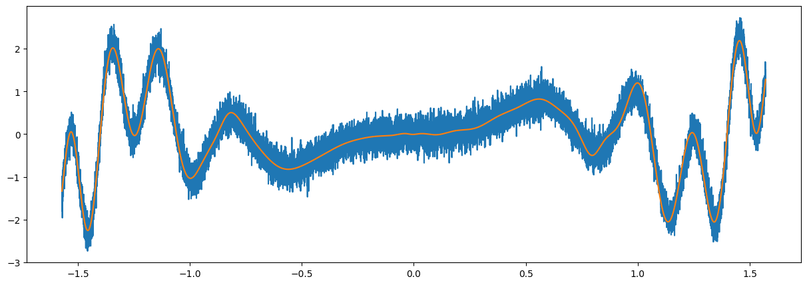

This example
can be found [FMCA_Samplet_GP_Filtering](https://github.com/muchip/fmca/blob/master/py/FMCA_Samplet_GP_Filtering.ipynb).


## Python notebooks

The notebooks below live in `py/` and are copied next to the compiled module in `build/py`,
so they can be run directly from there. They cover the samplet basis, the compression of
signals, images and kernel matrices, and the data driven refinement of the cluster tree.

| notebook | what it shows |
| --- | --- |
| [FMCA_Samplets](https://github.com/muchip/fmca/blob/master/py/FMCA_Samplets.ipynb) | the samplet transform of a signal sampled at scattered locations |
| [FMCA_SampletBasics](https://github.com/muchip/fmca/blob/master/py/FMCA_SampletBasics.ipynb) | samplet trees, what a samplet looks like in 1D and 2D, vanishing moments, orthogonality and sparsity of the transform |
| [FMCA_SampletCompression1D](https://github.com/muchip/fmca/blob/master/py/FMCA_SampletCompression1D.ipynb) | a signal in the natural basis versus the samplet basis, coefficient decay and best N-term approximation |
| [FMCA_SampletDenoising1D](https://github.com/muchip/fmca/blob/master/py/FMCA_SampletDenoising1D.ipynb) | hard and soft thresholding of samplet coefficients, and the universal threshold |
| [FMCA_SampletImageDenoising](https://github.com/muchip/fmca/blob/master/py/FMCA_SampletImageDenoising.ipynb) | compression and denoising of an image, and of the same image sampled at scattered points |
| [FMCA_SampletKernelCompression](https://github.com/muchip/fmca/blob/master/py/FMCA_SampletKernelCompression.ipynb) | the dense kernel matrix versus its samplet compression, accuracy against cost, and the scaling in N |
| [FMCA_SampletAdaptiveClustering](https://github.com/muchip/fmca/blob/master/py/FMCA_SampletAdaptiveClustering.ipynb) | adaptive partitions of a point cloud obtained from the samplet coefficients |
| [FMCA_Samplet_GP_Filtering](https://github.com/muchip/fmca/blob/master/py/FMCA_Samplet_GP_Filtering.ipynb) | filtering of the compressed kernel matrix for Gaussian process regression |
| [FMCA_Samplet_KRR](https://github.com/muchip/fmca/blob/master/py/FMCA_Samplet_KRR.ipynb) | kernel ridge regression in the samplet basis |
| [FMCA_GP](https://github.com/muchip/fmca/blob/master/py/FMCA_GP.ipynb) | Gaussian process learning based on the pivoted Cholesky decomposition |
| [FMCA_Cholesky](https://github.com/muchip/fmca/blob/master/py/FMCA_Cholesky.ipynb) | the different variants of the pivoted Cholesky decomposition |
| [FMCA_H2Matrix](https://github.com/muchip/fmca/blob/master/py/FMCA_H2Matrix.ipynb) | H2-matrix construction and fast matrix-vector products |
| [FMCA_LowRankBenchmarks](https://github.com/muchip/fmca/blob/master/py/FMCA_LowRankBenchmarks.ipynb) | low-rank benchmarks for adaptive joint distribution learning |
